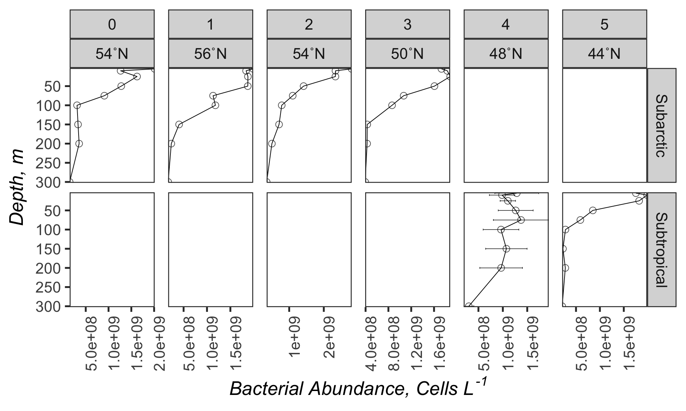
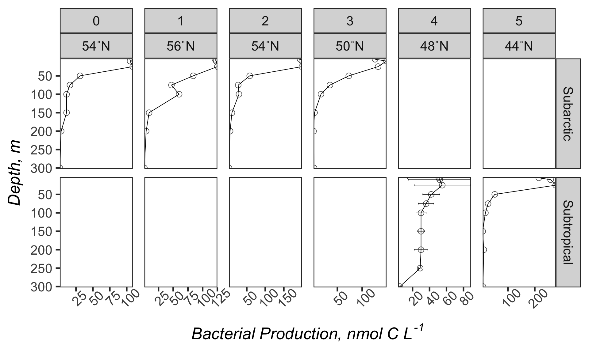

naames2
================
Nicholas Baetge
3/26/2020

# Intro

This document is primarily used to plot cast data on NAAMES 2, in
support of a manuscript being prepared by James Fox.

# Import and Wrangle Data

``` r
n2_data <- read_rds("~/naames2/Input/processed_bf.2.2020.rds") %>%
  select(Cruise:Station, degree_bin, Target_Z, BactProd_C, BactAbund) %>% 
  filter(Cruise == "AT34") %>% 
  rename(bp = BactProd_C, 
         ba = BactAbund) %>% 
  mutate(degree_bin = ifelse(Station == 4, 48, degree_bin),
         bp = ifelse(bp == "NaN", NA, bp),
         ba =  ifelse(ba == "NaN", NA, ba)) %>% 
  mutate_at(vars(bp), round) %>% 
  group_by(Cruise, Station, Target_Z) 
  
bp <- n2_data %>%
  select(-ba) %>% 
  drop_na(bp) %>% 
  mutate(ave_bp =  round(mean(bp)),
         sd_bp =round(sd(bp))) %>% 
  ungroup() %>% 
  select(-bp) %>% 
  distinct()
  
ba <- n2_data %>%
  select(-bp) %>% 
  drop_na(ba) %>% 
  mutate(ave_ba =  round(mean(ba)),
         sd_ba =round(sd(ba))) %>% 
  ungroup() %>% 
  select(-ba) %>% 
  distinct()

merge <- full_join(bp, ba) %>% 
  arrange(Station, Target_Z) %>% 
  mutate(region = ifelse(degree_bin >= 50, "Subarctic", "Subtropical" ))
```

# Plot Profiles

## Bacterial Abundance



## Bacterial Production



``` r
#ggsave("ba.jpg", ba.plot, device = "jpg",  width = 20, height = 12, path = "~/Desktop/") 
```

``` r
#ggsave("bp.jpg", bp.plot, device = "jpg",  width = 20, height = 12, path = "~/Desktop/") 
```
